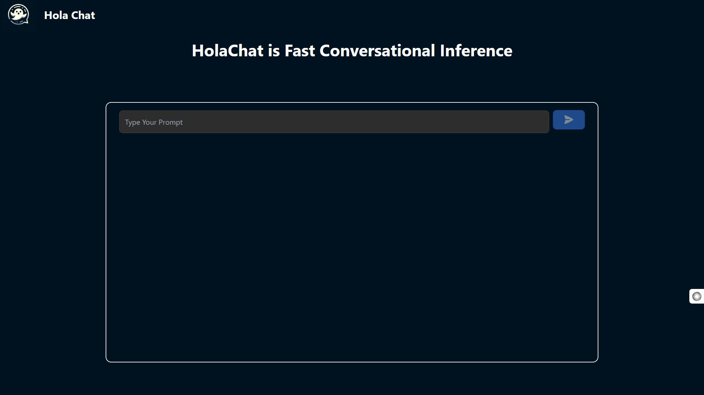

# HolaChat - Fast Conversational Inference

HolaChat is a modern, fast, and efficient chat interface built with React and TypeScript. It features a beautiful dark theme, code formatting, and real-time conversation capabilities.



## Features

- 🚀 Fast and responsive chat interface
- 🌙 Beautiful dark theme
- 💻 Code formatting and syntax highlighting
- 📋 Copy code functionality
- 📝 Markdown support
- 🔄 Real-time conversation
- 🎨 Modern UI with smooth animations

## Tech Stack

- React
- TypeScript
- Tailwind CSS
- Prism.js (for code highlighting)
- Vite (for fast development and building)

## Installation

### Prerequisites

- Node.js (v14 or higher)
- npm or yarn

### Setup

1. Clone the repository:
```bash
git clone https://github.com/ayush-patel-29/holachat.git
cd holachat
```

2. Install dependencies:
```bash
npm install
# or
yarn install
```

3. Create a `.env` file in the root directory and add your API keys:
```env
VITE_API_KEY=your_api_key_here
VITE_GROQ_API_KEY=your_api_key_here
```

4. Start the development server:
```bash
npm run dev
# or
yarn dev
```

5. Open your browser and navigate to `http://localhost:5173`

## Building for Production

To create a production build:

```bash
npm run build
# or
yarn build
```

The build files will be created in the `dist` directory.

## Project Structure

```
holachat/
├── src/
│   ├── components/
│   │   ├── TextFormatter.tsx
│   │   └── TextFormatter.module.css
│   ├── lib/
│   │   └── groq.ts
│   ├── App.tsx
│   ├── App.css
│   ├── main.tsx
│   └── index.css
├── public/
│   └── logo.jpg
├── package.json
├── tsconfig.json
├── vite.config.ts
└── README.md
```

## Usage

1. Type your message in the text area
2. Click the send button or press Enter to send
3. View the formatted response with code highlighting
4. Use the copy button to copy code snippets

## Contributing

Contributions are welcome! Please feel free to submit a Pull Request.

1. Fork the repository
2. Create your feature branch (`git checkout -b feature/amazing-feature`)
3. Commit your changes (`git commit -m 'Add some amazing feature'`)
4. Push to the branch (`git push origin feature/amazing-feature`)
5. Open a Pull Request

## License

This project is licensed under the MIT License - see the [LICENSE](LICENSE) file for details.

## Acknowledgments

- [React](https://reactjs.org/)
- [TypeScript](https://www.typescriptlang.org/)
- [Tailwind CSS](https://tailwindcss.com/)
- [Prism.js](https://prismjs.com/)
- [Vite](https://vitejs.dev/)

## Support

If you encounter any issues or have questions, please open an issue in the GitHub repository.
